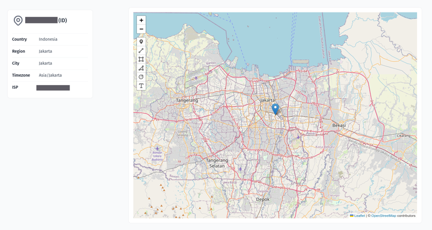

## Current City

#### data source
> https://api.ipgeolocation.io/getip

#### setup .env

```
VITE_API_GEOLOCATION=<API-KEY>
```

#### running
```
cd vue-tailwind-geolocation
npm i
npm run dev
```
#### screenshot


#### demo
https://vue-tailwind-geolocation.vercel.app/